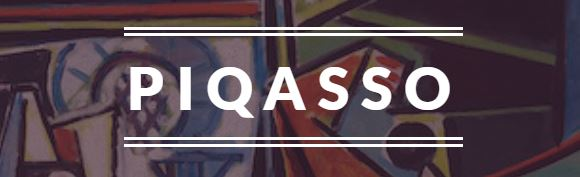

   
  

# Piqasso
An Image Generator that creates works of art using a real Quantum Computer.

## Description
We take advantage of noise naturally occurring in nature to generate beautiful abstract works of art representative of the data set they were trained on. We've made our code publically available on GitHub so you can train using your own datasets. 

## Screenshots

